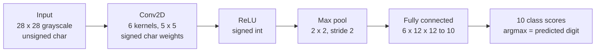

# Integer CNN Inference Engine in C

A LeNet-style convolutional neural network implemented from scratch in C with 8-bit integer weights and no floating-point arithmetic, plus hand-written MIPS assembly versions of the convolution kernel.

## Overview

University of Delaware coursework: **CPEG 323, Introduction to Computer Systems Engineering (Fall 2024)**. The assignment was a systems-engineering problem disguised as a machine-learning one: run inference for a small digit classifier using only integer arithmetic, then optimize the inner loop at the assembly level.

There is no framework here and no `float` in the data path. Weights and biases are `signed char`, accumulators are `signed int`, and the whole forward pass — convolution, ReLU, max pooling, fully-connected layer — is explicit nested loops over statically-typed matrices.

## Network Architecture



| Stage | Shape |
|---|---|
| Input | 28 × 28 |
| Conv (6 × 5×5 kernels) | 6 × 24 × 24 |
| Max pool (2×2, stride 2) | 6 × 12 × 12 |
| Fully connected | 10 class scores |

Dimensions, types and layer sizes are all declared as compile-time constants in `simple_cnn.h`, so the memory layout of every intermediate tensor is fixed and visible.

## Software / Tools

- **C** (C99), built with **GCC** via the provided `makefile`
- **lodepng** (MIT, vendored in `third_party/`) for PNG decoding
- **MIPS assembly** for the optimized convolution kernels
- **Python** reference implementation (`simple_cnn.py`) used to cross-check C output

## Key Engineering Work

**Integer-only inference.** Weights and biases are loaded from text files into `signed char` matrices; every multiply-accumulate happens in `signed int`. This is quantized inference done by hand — the same idea that makes neural networks run on microcontrollers — and it forces you to think about accumulator width and overflow rather than letting `float` hide the problem.

**Explicit memory layout.** `simple_cnn.h` typedefs every tensor as a fixed-dimension array (`CONV_WEIGHT_MATRIX`, `CONV_MAX_POOL_OUTPUT_MATRIX`, and so on). Nothing is heap-allocated and nothing is dynamically shaped, which makes the data movement through the network completely legible — and makes it possible to reason about cache behaviour in the assembly work.

**Fused convolution and pooling.** `convolution_max_pool()` produces pooled output directly rather than materializing the full 24×24 intermediate for every kernel, cutting both memory traffic and a full pass over the data.

**Assembly-level optimization.** `asm/convolution.s` and `simple_cnn_extended.s` are hand-written MIPS implementations of the convolution inner loop — the part of the network where essentially all the arithmetic happens. Writing it in assembly after writing it in C is what makes the cost of the loop structure concrete: address arithmetic, register pressure, and how much of the loop body is actually the multiply-accumulate.

**Defensive input handling.** Parameter files are checked for underrun (too few values for the declared tensor size) and input PNGs are rejected unless they match `INPUT_IMAGE_SIZE` exactly, so a shape mismatch fails loudly at load time instead of silently producing garbage classifications.

## Testing / Validation

- **Cross-checked against a Python reference.** `simple_cnn.py` implements the same network independently; C output was compared against it to confirm the integer pipeline matched.
- **Bundled test set.** `images/` contains one labelled 28×28 PNG per digit 0–9 with `dataset.txt` as the label manifest, so the classifier can be exercised end to end immediately after building.
- **Assembly verified against C.** The optimized kernels were checked by comparing their output to the C implementation on the same inputs, rather than being assumed correct.

## Build and Run

```bash
make
./simple_cnn
```

Parameters are read from `parameters/` (`conv_weights.txt`, `conv_biases.txt`, `linear_weights.txt`, `linear_biases.txt`) and images from `images/`.

## Repository Structure

```
main.c                    parameter/image loading and the inference driver
simple_cnn.h              layer dimensions, tensor typedefs, function prototypes
simple_cnn.py             independent Python reference implementation
simple_cnn_extended.s     MIPS assembly, extended kernel
asm/convolution.s         MIPS assembly, convolution inner loop
parameters/               trained weights and biases (integer text format)
images/                   28x28 test digits + dataset.txt label manifest
third_party/lodepng/      PNG decoder (MIT licence, not my code)
makefile
```

## What I Learned

Removing floating point from a neural network is not a small change — it re-frames the whole problem as one about numeric range. Once weights are 8-bit, the questions become how wide the accumulator has to be and where saturation could occur, which is exactly the reasoning embedded inference depends on.

Writing the convolution twice — once in C, once in MIPS — was the most useful part. In C the inner loop looks like three nested `for` statements. In assembly you can count the instructions that are actually doing the multiply-accumulate versus the ones computing addresses, and it becomes obvious why loop ordering and data layout matter so much more than the arithmetic itself.

## Academic Context

University of Delaware, CPEG 323 — Introduction to Computer Systems Engineering, Fall 2024 (Projects 2 and 3). The network topology, trained parameters and assignment specification were provided by the course; the C implementation, assembly optimization and validation work are my own. `third_party/lodepng/` is Lode Vandevenne's MIT-licensed PNG library, included unmodified with its licence.
